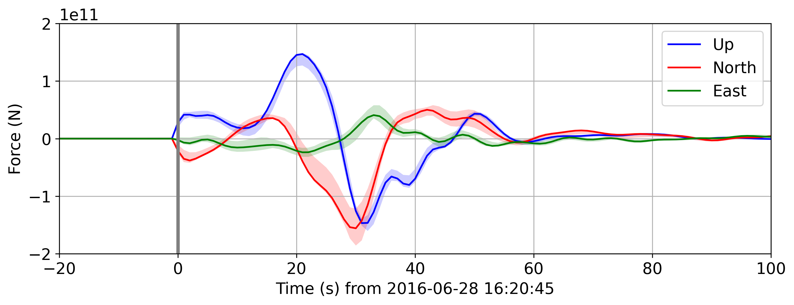

*lsforce*
=========

[](https://code.usgs.gov/ghsc/lhp/lsforce/pipelines/latest) [](https://code.usgs.gov/ghsc/lhp/lsforce/-/jobs)

*lsforce* is a Python-based single-force seismic inversion framework for massive
landslides. The codes can also be applied to other seismic sources that are
well-approximated as a single force (e.g., volcanic eruptions, some glacial events). The
library can be used to invert long period (tens to hundreds of seconds) seismic
waveforms to estimate a time series vector of single forces that represents the
equivalent forces exerted on the Earth by the landslide (see example output figure
below).

<!--
The below example force-time function is created using the following code (run directly
after the inversion step in notebooks/example_lamplugh.ipynb)

import matplotlib.pyplot as plt
plt.rcParams.update({'font.size': 14})
fig = force_full.plot_forces(xlim=(-20, 100));
LIM = 2e11
fig.axes[0].set_ylim(-LIM, LIM)
fig.savefig(
    '../example_force_history_NEW.png',
    bbox_inches='tight',
    transparent=True,
    dpi=300,
)
-->


Installation
------------

The following has only been tested on macOS.

Clone this repo and run the installation script, which creates an environment named
`lsforce` and installs the _lsforce_ package into the environment:
```shell
git clone https://code.usgs.gov/ghsc/lhp/lsforce.git
cd lsforce
bash install.sh  # Or `bash install.sh 1` if you want developer tools as well
```
The install script will check if you have the
[`conda`](https://docs.conda.io/en/latest/) or
[`mamba`](https://mamba.readthedocs.io/en/latest/) package managers installed. If you
have both installed, it will use `mamba`. If you have neither installed, it will install
`mamba` and then use it. **If you only have `conda` installed, we strongly recommend
that you install `mamba` before running the install script. `mamba` is much, much faster
than `conda` when solving the `lsforce` environment.**

By default, the Green's functions used by *lsforce* come from the
[Synthetics Engine (Syngine)](https://ds.iris.edu/ds/products/syngine/) hosted by
[IRIS Data Services](https://ds.iris.edu/ds/products/). The user can choose from a fixed
set of [1D Earth models](https://ds.iris.edu/ds/products/syngine/#earth).

Alternatively, if users prefer to compute Green's functions using a custom model (see
[Documentation](#documentation)), they can optionally install
[Computer Programs in Seismology (CPS)](http://www.eas.slu.edu/eqc/eqccps.html) via the
following:

   1. Install [GCC](https://gcc.gnu.org/) with e.g. [Homebrew](https://brew.sh/):
      ```shell
      brew install gcc
      ```
   2. Complete the
      [CPS license form](http://www.eas.slu.edu/eqc/eqc_cps/CPS/cpslisc.html), download
      the resulting archive, and unzip
   3. Move the directory `PROGRAMS.330` to where you'd like to install, then:
      ```shell
      cd PROGRAMS.330
      ./Setup OSX40
      ./C
      ```
   4. Add the executables to `PATH` by adding the following line to e.g.
      `~/.bash_profile`:
      ```shell
      export PATH="$PATH:/path/to/PROGRAMS.330/bin"
      ```

Documentation
-------------

Documentation for *lsforce* is visible online
[here](https://ghsc.code-pages.usgs.gov/lhp/lsforce).

To build the interactive HTML documentation yourself, first ensure that you installed
the developer tools (`bash install.sh 1`), which are required for documentation
building. Then:
```shell
conda activate lsforce
cd doc
make html
open _build/html/index.html  # macOS command to open file in browser
```
(To build Markdown documentation, use `make markdown`.)

The *lsforce* package includes a script,
[`axisem2cps`](bin/axisem2cps),
which can convert 1D Earth models from Syngine into CPS model files. These models can
then be further modified for specific use cases. In addition, completely custom CPS
model files can be provided; for more information on CPS model files, see Chapter 8 of the
[CPS documentation](http://www.eas.slu.edu/eqc/eqc_cps/CPS/CPS330/cps330o.pdf). The
`lsforce` conda environment must be active for the script to be available.

Usage examples for the two currently-supported parameterization methods are given in the
three [Jupyter Notebooks](https://jupyter.org/) `example_full.ipynb`,
`example_triangle.ipynb`, and `example_lamplugh.ipynb`, which are located in the
`notebooks` directory. To open the notebooks, run:
```shell
conda activate lsforce
jupyter notebook notebooks
```
This will start a Jupyter Notebook server and open a new window or tab in your browser
with the interactive notebooks displayed.

Mirrors
-------

The primary host for the development of this software is on **code.usgs.gov** (GitLab) here:

- https://code.usgs.gov/ghsc/lhp/lsforce

One drawback of the USGS GitLab is that it's more cumbersome for external users to create an
account and post issues than on GitHub. Hence, we've made a mirror of this repository on GitHub
here:

- https://github.com/DOI-USGS/lsforce

If you have a GitHub account, you can immediately post issues to this mirrored repository.

Testing
-------

Tests are located in the `tests` directory. To run the tests, first ensure that you
installed the developer tools (`bash install.sh 1`), which are required for testing.
Then:
```shell
conda activate lsforce
pytest
```

Citations
---------

<p style="text-indent:-36px; padding-left:36px;">
Allstadt, K. E., Toney, L., & Collins, E. A. (2023). <i>lsforce</i> (Version 1.1) [Source code]. U.S.
Geological Survey Software Release.
<a href="https://doi.org/10.5066/P9CR20KW">https://doi.org/10.5066/P9CR20KW</a>
</p>

<p style="text-indent:-36px; padding-left:36px;">
Toney, L., & Allstadt, K. E. (2021). lsforce: A Python-based single-force seismic
inversion framework for massive landslides. <i>Seismological Research Letters,
92</i>(4), 2610–2626.
<a href="https://doi.org/10.1785/0220210004">https://doi.org/10.1785/0220210004</a>
</p>
